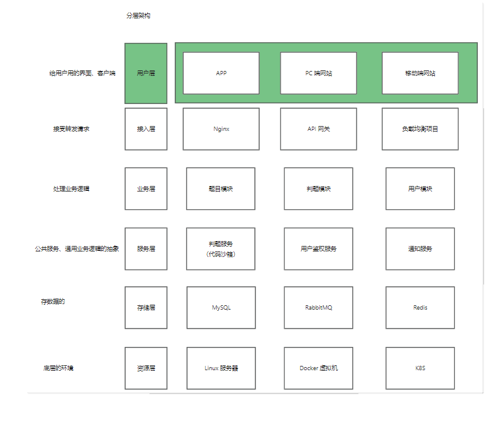
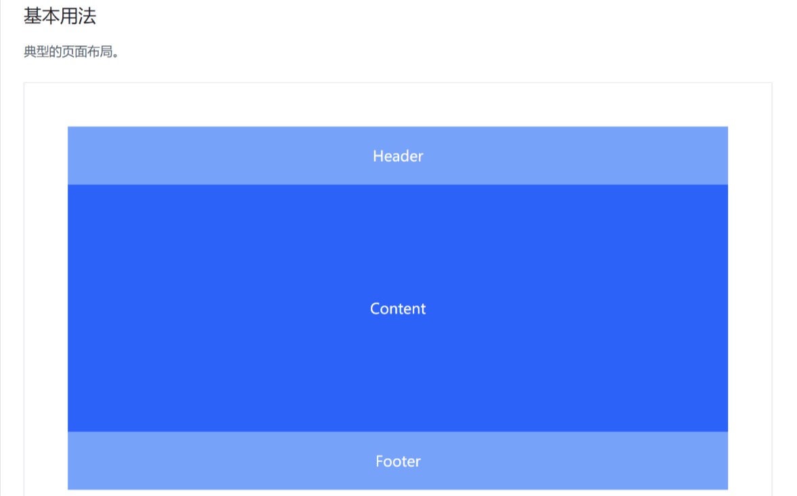

# 鱼OJ项目第一期

### 技术选型

前端： Vue3、Arco Design 组件库、在线代码编辑器、在线文档浏览
Java进程控制、Java安全管理器、JVM
虚拟机（云服务器）、Docker（代码沙箱实现）
Spring Cloud微服务、消息队列、多种设计模式

### 架构设计



#### 前端项目初始化

##### 确认node版本
nodejs版本：v18.16.0或16
检测命令
```shell
node -v
```
npm版本
```shell
npm -v
```
##### 初始化

使用vue-cli进行初始化
安装脚手架工具
```shell
npm install -g @vue/cli
```
检测是否安装成功命令
```shell
vue -V
```
创建项目
```shell
vue create yuoj-frontend
```
#### 引入组件
1. 执行安装
```shell
npm install --save-dev @aco-design/web-vue
```

2. `main.ts`中增加样式
```shell
import { createApp } from "vue";
import App from "./App.vue";
import router from "./router";
import store from "./store";
import ArcoVue from "@arco-design/web-vue";
import "@arco-design/web-vue/dist/arco.css";
```
#### 项目通用布局
1. 新建一个布局，在`App.vue`中引入
`App.vue`中代码如下
```vue
<div id="app">
  <BaseLayout/>
</div>
```
2. 选用arco Design 的layout组件(https://arco.design/vue/component/layout)
先把上中下布局编排好 在填充内容

3. 实现通用菜单组件
菜单组件(https://arco.design/vue/component/menu)
目标：根据路由信息配置，自动生成菜单内容 实现更通用 更自动的菜单配置

步骤：
- 1）提取通用路由文件
- 2）菜单组件读取路由，动态渲染菜单
- 3）绑定跳转事件
- 4）同步路由的更新到菜单项高亮

同步高亮原理：首先点击菜单项 =&gt; 触发点击事件，跳转更新路由 =&gt; 更新路由后，同步去更新菜单栏的高亮状态。

使用 Vue Router 的 afterEach 路由钩子实现：
```javascript
const router = useRouter();

const selectedKeys = ref(['/'])

router.afterEach((to,from,failure) => {
    selectedKeys.vlaue = [to.path]
})
```

#### 全局状态管理

vuex: https://vuex.vuejs.org/zh/guide/ (vue-cli脚手架已经引入)

- state：存储的状态信息，比如用户信息 
- mutation（尽量同步）：定义了对变量进行增删改（更新）的方法 
- actions（支持异步）：执行异步操作，并且触发 mutation 的更改（actions 调用 mutation） 
- modules（模块）：把一个大的 state（全局变量）划分为多个小模块，比如 user 专门存用户的状态信息

实现

先在store目录下定义user模块，存储用户信息：
```typescript
import {StoreOptions} from "vuex";

export default {
    namespaced: true,
    state: () => ({loginUser: {userName: "未登录",},}),
    actions: {
        getLoginUser({commit, state}, payload) {
            commit("updateUser", {userName: "cute050"});
        },
    },
    mutations: {
        updateUser(state, payload) {
            state.loginUser = payload;
        },
    },
} as StoreOptions<any>;
```
然后在store目录中定义index.ts文件，导入user模块：
```typescript
import {createStore} from "vuex";
import user from "./user";

export default createStore(
    {
        mutations: {}, 
        actions: {}, 
        modules: {user,
        },
    });
```
在vue页面中可以获取已存储的状态变量：
```typescript
const store = useStore();
store.state.user?.loginUser
```
在vue页面中可以修改状态变量：
> 使用dispatch 来调用之前定义好的actions
```typescript
store.dispatch("user/getLoginUser", { userName: "鱼皮", });
```
#### 全局权限管理
目标：能够直接以一套通用的机制，去定义哪个页面需要那些权限。而不用每个页面独立去判断权限，提高效率。 

思路： 
1. 在路由配置文件， 定义某个路由的访问权限 
2. 在全局页面组件 app.vue 中，绑定一个全局路由监听。每次访问页面时，根据用户要访问页面的路由信息，先判断用户是否有对应的访问权限。 
3. 如果有，跳转到原页面；如果没有，拦截或跳转到 401 鉴权或登录页 示例代码如下：

示例代码如下:
```typescript
const router = useRouter();
const store = useStore();
router.beforeEach((to, from, next) => {
    // 仅管理员可见，判断当前用户是否有权限 
    if (to.meta?.access === "canAdmin") {
        if (store.state.user.loginUser?.role !== "admin") {
            next("/noAuth");
            return;
        }
    }
    next();
});
```
#### 通用导航栏组件 - 根据配置控制菜单的显隐
1. routes.ts 给路由新增一个标志位 用户判断路由是否显隐
```javascript
  {
    path: "/hide",
    name: "隐藏页面",
    component: HomeView,
    meta: {
      hideInMenu: true,
    }
```
2. 不要用 v-for + v-if 去条件渲染元素，这样会先循环所有的元素，导致性能的浪费 推荐：先过滤只需要展示的元素数组
```typescript
// 展示在菜单的路由数组 
const visibleRoutes = routes.filter((item, index) => {
    if (item.meta?.hideInMenu) {
        return false;
    }
    return true;
});
```
##### 根据权限隐藏菜单
需求：只有具有权限的菜单，才对用户可见 
类似上面的控制路由显示隐藏，只要判断用户没有这个权限，就直接过滤掉 
1. 新建 access 目录，专门用一个文件来定义权限
```typescript
/**
 *  权限定义
 */
const ACCESS_ENUM = {
    NOT_LOGIN: "notLogin", 
        USER: "user", 
        ADMIN: "admin",
    };
export default ACCESS_ENUM;
```
2. 定义一个公用的权限校验方法 

为什么？因为菜单组件中要判断权限、权限拦截也要用到权限判断功能，所以抽离成公共方法 

创建 checkAccess.ts 文件，专门定义检测权限的函数：
```typescript
import ACCESS_ENUM from "@/access/accessEnum";

/** 检查权限（判断当前登录用户是否具有某个权限）
 * @param loginUser 当前登录用户
 * @param needAccess 需要有的权限
 * @return boolean 有无权限
 */
const checkAccess = (loginUser: any, needAccess = ACCESS_ENUM.NOT_LOGIN) => {
    // 获取当前登录用户具有的权限（如果没有 loginUser，则表示未登录） 
    const loginUserAccess = loginUser?.userRole ?? ACCESS_ENUM.NOT_LOGIN;
    if (needAccess === ACCESS_ENUM.NOT_LOGIN) {
        return true;
    }
// 如果用户登录才能访问 
    if (needAccess === ACCESS_ENUM.USER) {
        //如果用户没登录，那么表示无权限 
        if (loginUserAccess === ACCESS_ENUM.NOT_LOGIN) {
            return false;
        }
    }
// 如果需要管理员权限 
    if (needAccess === ACCESS_ENUM.ADMIN) {
        // 如果不为管理员，表示无权限 
        if (loginUserAccess !== ACCESS_ENUM.ADMIN) {
            return false;
        }
    }
    return true;
};
export default checkAccess;
```
3. 修改 GlobalHeader 动态菜单组件，根据权限来过滤菜单 注意，这里使用计算属性，是为了当登录用户信息发生变更时，触发菜单栏的重新渲染，展示新增权限的菜单项

```typescript
const visibleRoutes = computed(() => {
    return routes.filter((item, index) => {
        if (item.meta?.hideInMenu) {
            return false;
        }
        if (!checkAccess(store.state.user.loginUser, item?.meta?.access as string)) {
            return false;
        }
        return true;
    });
});

```
##### 全局项目入口
```typescript
const doInit = () => {
  console.log("欢迎访问我的博客 https://argon.zzzyu.cn");
};
onMounted(() => {
  doInit();
});
```

### 后端项目初始化

#### 下载模板
此处省略....

### 前后端联调

1. 安装axios
```shell
npm install axios
```

2. 编写调用后端的代码
传统情况下，每个请求都要单独编写代码。至少得写一个请求路径 
完全不用！！！ 直接自动生成即可：https://github.com/ferdikoomen/openapi-typescript-codegen 
首先安装：
```shell
npm install openapi-typescript-codegen --save-dev
```
执行生成代码命令：
```shell
openapi --input http://localhost:8101/api/v2/api-docs --output ./generated --client axios
```

3. 直接使用生成的service代码 调用函数发送请求即可 比如登录信息
```typescript
const res = await UserControllerService.getLoginUserUsingGet();
if (res.code === 0) {
    commit("updateUser", res.data);
} else {
    commit("updateUser", {
        ...state.loginUser,
        userRole: ACCESS_ENUM.NOT_LOGIN,
    });
}
```
4. 直接定义axios请求库的全局参数 比如全局请求拦截器
```typescript
// 添加请求拦截器
import axios from "axios";

// axios.defaults.withCredentials = true;

// const instance = axios.create({
//   baseURL: "http://localhost:8101",
//   timeout: 1000,
// });

axios.interceptors.request.use(
  function (config) {
    console.log(config);
    // 在发送请求之前做些什么
    return config;
  },
  function (error) {
    // 对请求错误做些什么
    return Promise.reject(error);
  }
);

// 添加响应拦截器
axios.interceptors.response.use(
  function (response) {
    console.log("响应", response);
    // 2xx 范围内的状态码都会触发该函数。
    // 对响应数据做点什么
    return response;
  },
  function (error) {
    // 超出 2xx 范围的状态码都会触发该函数。
    // 对响应错误做点什么
    return Promise.reject(error);
  }
);

```

##### 用户登录功能
###### 自动登录
在store\user.ts中编写获取远程登录用户信息的代码：
```typescript
actions: {
    async getLoginUser({ commit, state }, payLoad) {
        const res = await UserControllerService.getLoginUserUsingGet();
        if (res.code === 0) {
            commit("updateUser", res.data);
        } else {
            commit("updateUser", {
                ...state.loginUser,
                userRole: ACCESS_ENUM.NOT_LOGIN,
            });
        }
    },
},
```
在哪里去触发 getLoginUser 函数的执行？应当在一个全局的位置 
有很多选择： 
1. 路由拦截 ✔ 
2. 全局页面入口 app.vue 
3. 全局通用布局（所有页面都共享的组件） 

此处选择第一种方案，可以直接在全局权限管理的路由拦截中判断用户是否已经登录了。

##### 全局权限管理优化
新建 access\index.ts 文件，把原有的路由拦截、权限校验逻辑放在独立的文件中
优势：只要不引入、就不会开启、不会对项目有影响

示例代码：
```typescript
import router from "@/router";
import store from "@/store";
import ACCESS_ENUM from "@/access/accessEnum";
import checkAccess from "@/access/checkAccess";

router.beforeEach(async (to, from, next) => {
  const loginUser = store.state.user.loginUser;

  // if (!loginUser || !loginUser.userRole) {
  //   await store.dispatch("user/getLoginUser");
  // }

  const needAccess = (to.meta?.access as string) ?? ACCESS_ENUM.NOT_LOGIN;
  if (needAccess !== ACCESS_ENUM.NOT_LOGIN) {
    if (!loginUser || !loginUser.userRole) {
      next(`user/login?redirect=${to.fullPath}`);
      return;
    }
    if (!checkAccess(loginUser, needAccess)) {
      next("/noAuth");
      return;
    }
  }

  next();
});

```

#### 支持多套布局
```typescript
export const routes: Array<RouteRecordRaw> = [
  {
    path: "/user",
    name: "用户",
    component: UserLayout,
    meta: {
      hideInMenu: true,
    },
    children: [
      {
        path: "/user/login",
        name: "用户登录",
        component: UserLoginView,
      },
      {
        path: "/user/register",
        name: "用户注册",
        component: UserRegisterView,
      },
    ],
  },
]
```

App.vue 页面修改
```vue
<template>
  <div id="app">
    <template v-if="route.path.startsWith('/user')">
      <router-view />
    </template>
    <template v-else>
      <BaseLayout />
    </template>
  </div>
</template>

<style>
#app {
}
</style>
<script setup>
import BaseLayout from "@/layouts/BaseLayout";
import { onMounted } from "vue";
import { useRoute } from "vue-router";

const route = useRoute();
const doInit = () => {
  console.log("欢迎访问我的博客 https://argon.zzzyu.cn");
};
onMounted(() => {
  doInit();
});
</script>

```

#### 登录页面开发
```vue
<template>
  <div id="userLoginView">
    <h2 style="margin-bottom: 16px">用户登录</h2>
    <a-form
      style="max-width: 480px; margin: 0 auto"
      label-align="left"
      auto-label-width
      :model="form"
      @submit="handleSubmit"
    >
      <a-form-item field="userAccount" tooltip="请输入账号" label="账号">
        <a-input v-model="form.userAccount" placeholder="请输入账号" />
      </a-form-item>
      <a-form-item field="userPassword" label="密码">
        <a-input-password
          v-model="form.userPassword"
          placeholder="请输入密码"
        />
      </a-form-item>
      <a-form-item>
        <a-button
          type="primary"
          style="display: block; margin: 0 auto; width: 160px"
          html-type="submit"
          >登录
        </a-button>
      </a-form-item>
    </a-form>
  </div>
</template>

<script setup lang="ts">
import { reactive } from "vue";
import { UserControllerService, UserLoginRequest } from "../../../generated";
import message from "@arco-design/web-vue/es/message";
import { useRouter } from "vue-router";
import { useStore } from "vuex";

const router = useRouter();
const store = useStore();

const form = reactive({
  userAccount: "",
  userPassword: "",
} as UserLoginRequest);
const handleSubmit = async () => {
  const res = await UserControllerService.userLoginUsingPost(form);
  if (res.code === 0) {
    await store.dispatch("user/getLoginUser");
    await router.push({
      path: "/",
      replace: true,
    });
  } else {
    message.error("登录失败，" + res.msg);
  }
};
</script>
```

--------------------- 本期完 / 2023/9/20 ---------------------------
